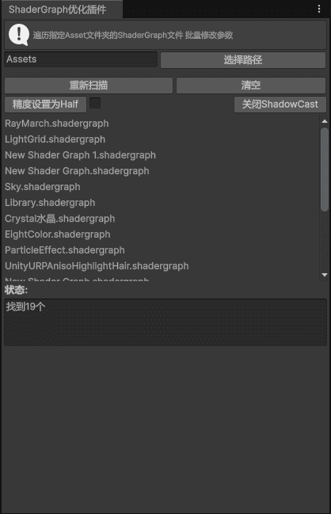

# LiMiTools-for-Unity
LiMiTools for Unity是LiMi开发的第一个Unity编辑器工具包

## 使用方法：打开Unity -> 窗口 -> 包管理器 -> "+" -> 安装来自git URL 的包...  -> 输入(https://github.com/LiMiSensei/LiMiTools-for-Unity.git)

## Prerequisites
### Unity 6000.0.50
该软件包正在开发中，使用Unity6000.0.50
### Test
<table>
<tr>
<td> Test 4</td>
</tr>
</table>

<table>
<tr>
<td> Test 1</td>
<td> Test 2</td>
<td> Test 3</td>
<td> Test 4</td>
</tr>
<tr>
<td> Test 5</td>
<td> Test 6</td>
<td> Test 7</td>
<td> Test 8</td>
</tr>
<tr>
<td> Test 9</td>
<td> Test 10</td>
<td> Test 11</td>
<td> Test 12</td>
</tr>
<tr>
<td colspan="4"> Test 13</td>
</tr>
</table>

## Getting Started
用户手册在补充中，（https://github.com/LiMiSensei/LiMiTools-for-Unity/blob/main/Editor/%E8%AF%B4%E6%98%8E.pur）

# 联系到我：AreYea@yeah.net or QQ:324477544